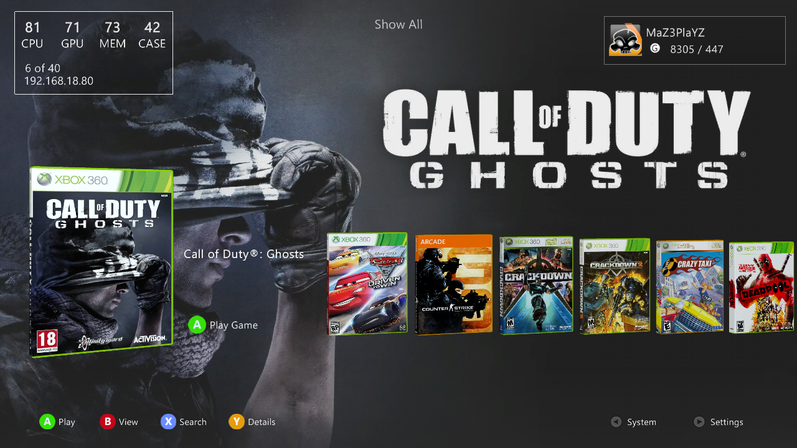
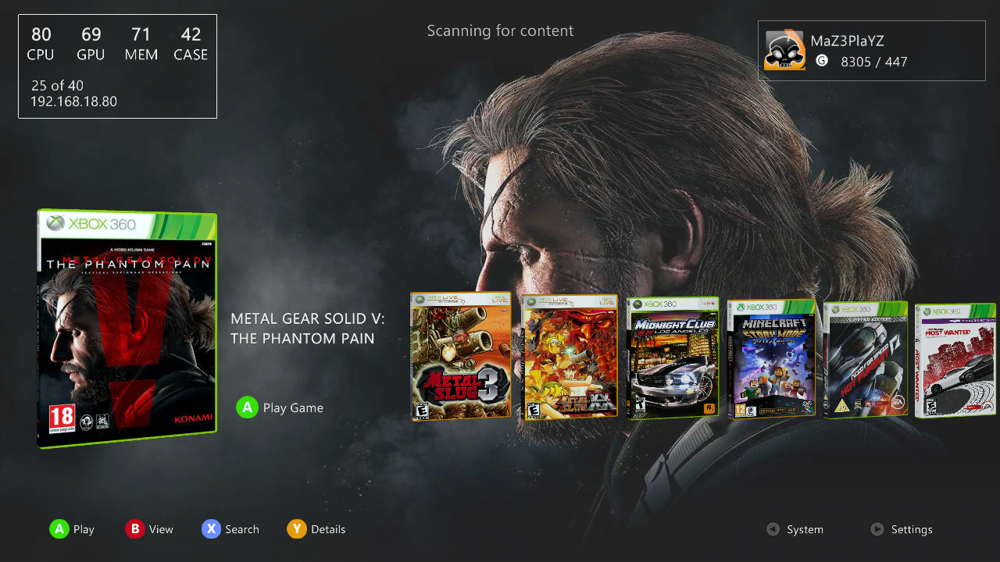

# AuroraFlow

**AuroraFlow** is a modern revised version of **Aurora Full Background Theme by CH360**, featuring a custom Xbox 360 Aurora boot animation and a custom modern flow layout.

## ✨ Features

- Modern revised version of the **Aurora Full Background Theme**
- Custom **Xbox 360 Aurora boot animation**
- Custom modern **flow layout**
- Custom **Profile Banner** Option
- Updated visual style
- Additional carousel layout included

## 🎨 Layouts

### Modern By MaZ3

This layout was specifically designed to match the style of the **AuroraFlow** theme.

### Bottom Carousel

This layout can be used with other Aurora skins.

> **Note:** The **Bottom Carousel** layout is not designed to match the style of AuroraFlow. 

## 📸 Screenshots

## 📌 Credits

- **CH360** — Original Aurora Full Background Theme
- **MaZ3** — AuroraFlow revisions
- **MaZ3** — Custom Aurora boot animation
- **MaZ3** — Modern By MaZ3 layout

## 📥 Installation

1. Download the latest release.
2. Extract the downloaded files.
3. Copy the skin to your Aurora `Skins` folder.
4. Open Aurora.
5. Press **B** → **Skin**.
6. Select **AuroraFlow**.
7. Select **Modern By MaZ3** as the layout.

---

**AuroraFlow** — A modern flow experience for Xbox 360 Aurora. 🎮
