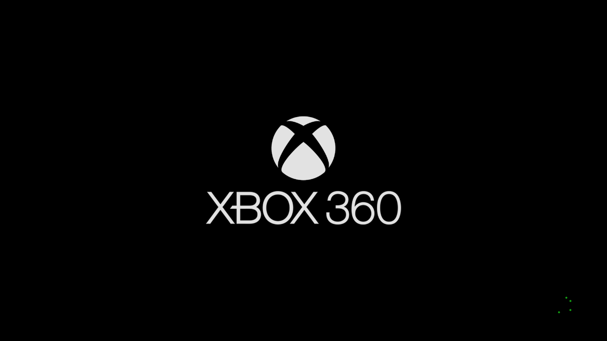
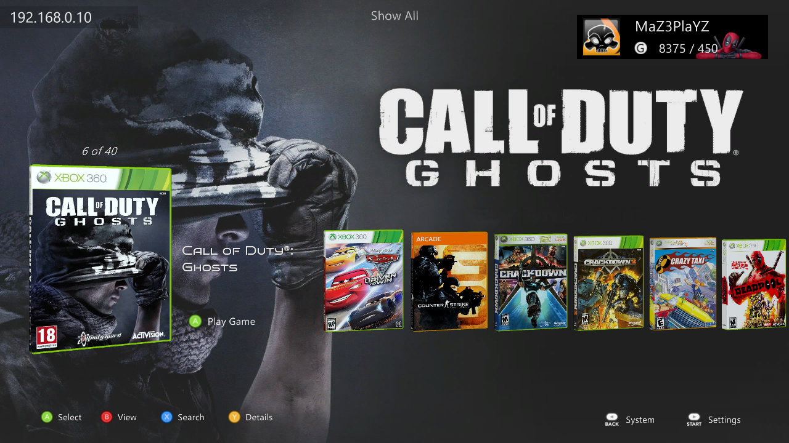
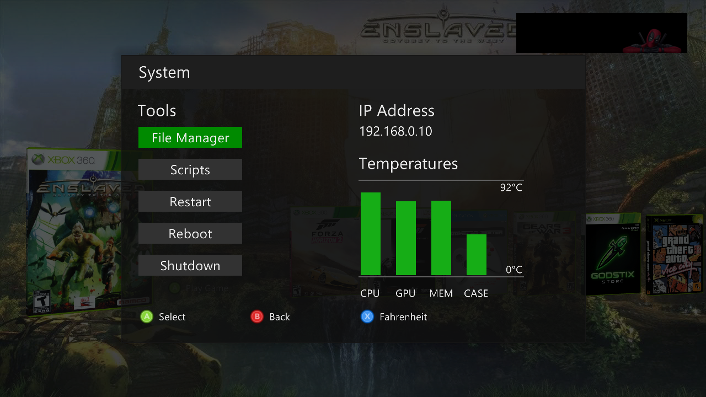
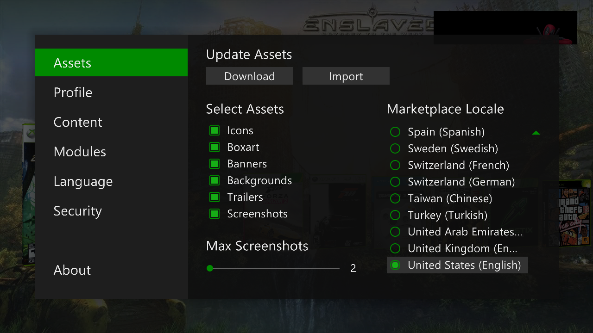
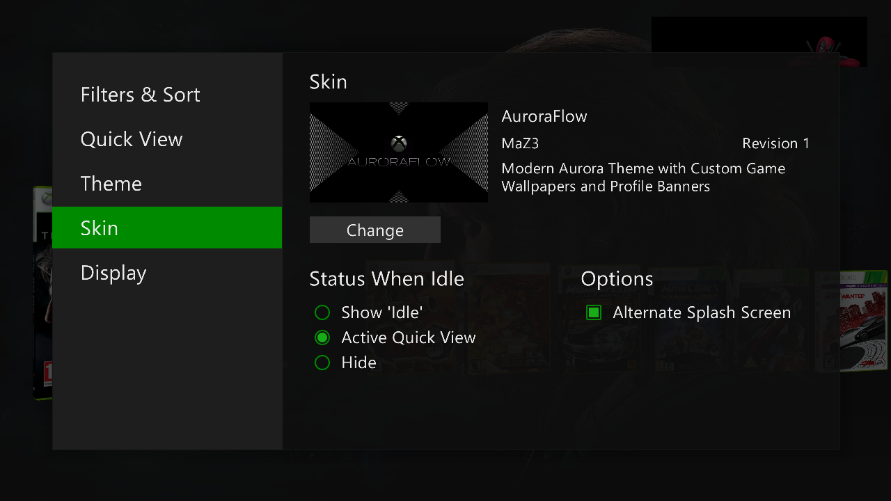

# AuroraFlow

**AuroraFlow** is a modern style Xbox 360 theme featuring a custom Boot animation from the **Dark Ultimate Theme**, Custom Backgrounds for each, and also Custom profile banners.

## ✨ Features

- Custom **Game Backgrounds** for each Game
- Custom **Xbox 360 Aurora boot animation**
- Custom modern **flow layout**
- Custom **Profile Banner** Option
- Updated visual style
- Additional carousel layout included

## 🎨 Layouts

### Modern By MaZ3

This layout was specifically designed to match the style of the **AuroraFlow** theme.

### Bottom Carousel

This layout can be used with other Aurora skins.

> **Note:** The **Bottom Carousel** layout is not designed to match the style of AuroraFlow.

## 📥 Installation

1. Download the latest release.
2. Extract the downloaded files.
3. Copy the skin to your Aurora in **Aurora/User/Backgrounds**.
4. Open Aurora.
5. Press **B** → **Skin**.
6. Select **AuroraFlow**.
7. Disable **Animation**.
8. Select **Modern By MaZ3** as the layout.

---

**AuroraFlow** — A modern flow experience for Xbox 360 Aurora. 🎮
